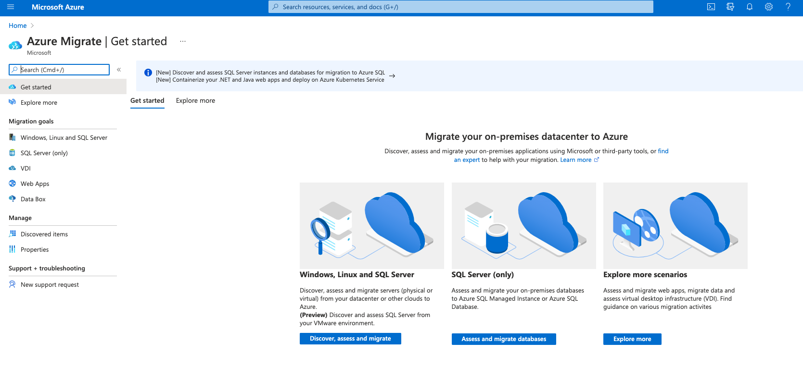

# Azure-migration

Guidelines for Azure migration

It is important to have a deep understanding of the service, migration capabilities and tooling options.

## The Five R's of Migration

- Rehost (lift and shift)
- Refactor (moving services from VM to PAAS, without changing app code)
- Rearchitect (changing Architecture, changing the code, moving to microservices, active-active solution cosmos DB multiright )
- Rebuild (re-architecture it's not worth the time invested)
- Replace (looking at my app I found that there is something else that makes the job)

## Migration Planning

- Discover (What we have and what workloads depends on)
- Assess (What we really need to make the app to function, usage over time, peaks and lows). Map to Azure resources. Using tools such as Azure Migrate.)
- Migrate (Tooling for migration, ex. replicate and move a virtual machine, database replication, containarized an application, move an app to an app service). First do a test migration once the app complies with security and SLAs, then you failover with minimum downtime.
- Optimize (What we can do to optimize once it is migrated - HPA, monitoring, etc)

## Azure Migrate

An azure solution to drive complete migration effort. Supports:

- Discovery (gives you dependencies and performance requirements)
- Assessment (provides inputs to suggested sizing on Azure components)
- Migration (perform the migration)

Supports VM, Databases, webapps (.net, Windows, Java apps & PHP apps) and VDI environments.
Once migration done you can review Azure Advisor for the optimization.

Supports On-premises, Hyper-V, VMware, Physical machines, Windows and Linux. Leveraging ASR - Azure site recovery -

Supports agentless and agent-based discovery

- Agent base requires read-only credential and a local admin acccount for the actual OS instances to discover apps and dependencies for VMware VMs

## Azure Target Services

PaaS (Virtual Window desktop, App Service Plans, Azure DB offers) goal is to lower TCO.

- AVS - Azure VMWARE solution- VMs
- Azure VMs & (WVD) - Windows Virtual Desktop
- Azure VMSS - Virtual Machines Scale sets -
- AKS - Azure Kubernetes Service
- App Services
- PaaS Database

## Assess

After discovery is complete the assessment tool can be run againgst Azure and AVS. It can help with prioritization of target based on utilization percentage. Dependencies can also be vwiewed through the generated service map.
You can run reports and it supports [Azure powershell](https://github.com/Azure/azure-docs-powershell-samples/tree/master/azure-migrate) and PowerBI.

For DBs, the target is assessed using the Database Migration Assistant and Service tool which will be doing the DB migration.

_hint_ always clean up the environment before the migration.

## VM Migration

- Replicate (VMware and Hyper-v agentless option)
- Test migrate
- Migrate
- Monitor, backup, etc.

## Databasse Migration

Data Migration Assistand and Azure Database Migration Service  - Scan source database for features used an daxcertain compatibility with target platforms. Supports offline and online migration.
Using premium you can do an online migration. [Here are](https://docs.microsoft.com/en-us/azure/dms/resource-scenario-status) supported scenarios.
Premium 4 vCore is free for the first 6 months.

- Download Data Migration Assistant. Which connect to Azure Migration tool.

## Web App Migration

- Performs a scan of public facing or internal web apps
- Full assessment of suitability for hosting your app in Azure App Service
- If you use app migration assistant (GA in Windows and previou for Linux, supporting .NET, PHP and Java) it can connect to your azure subscription and perform migration of application.
- It can support to migrate app database or set up an hybrid connection to communicate with On-premise DB.
- [appmigration.microsoft.com](https://appmigration.microsoft.com)

## Optimization

- Azure Advisor is the best place.

## Azure App Services

- Multiple languages and frameworks
- High availability and scalability
- Windows and Linux
- Easy integration with version control systems
- Security and compliance
- API and mobile features.

## Migration strategy

Follow [this link](Azure-tools-app-migration.md)
